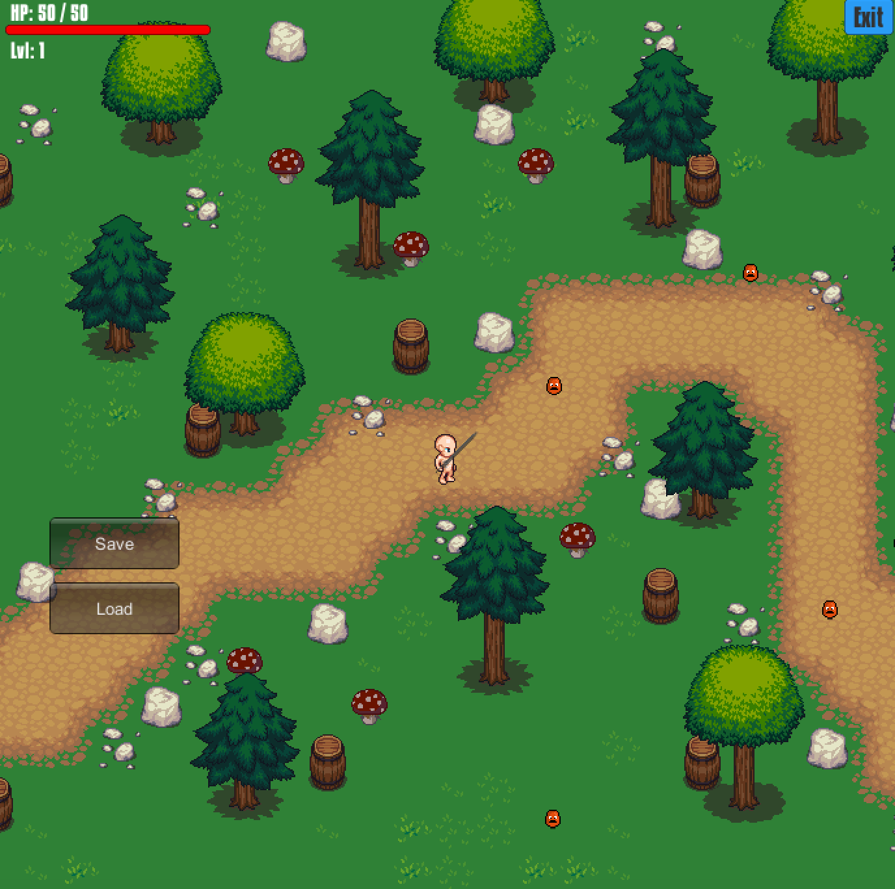

# Paper-Prince
2.5D basic RPG made in unity. Has basic health,  experience, and scene changing systems. Attack and walking animations.

## Content
- Spawns you in a simple scene. 
- Has enemies that will damage you if contact is made.
- Attack move if mouse click.
- With each enemy killed, experience is gained and may level up from it.
- When you level up your attack and defense stats increase.
- Health Bar changes with damage taken.
- Can exit and restart.

### Warning! SAVE and LOAD aren't functional.

## Graphics

